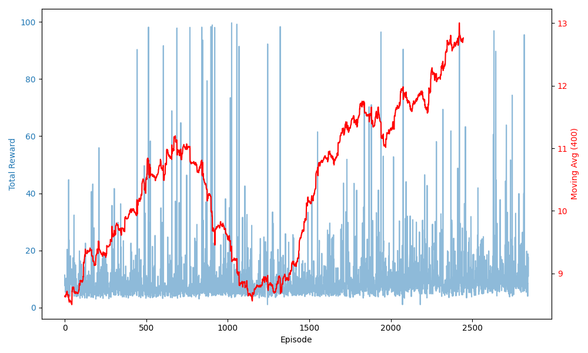
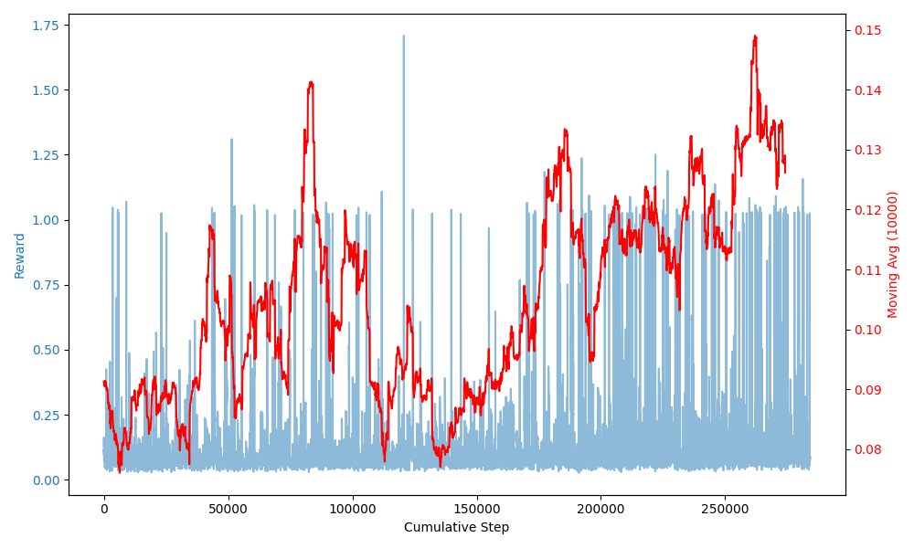

# Deep Q Network (DQN) for Object Pushing Task

## Overview

In this homework, a Deep Q Network (DQN) is trained to push an object to a desired position. The reinforcement learning agent interacts with the environment and learns to maximize the total reward through trial and error.

## Network Structure

- **Input Size**: 6 (high level state representation)
- **Hidden Layers**:
  - Layer 1: Fully connected (Linear) with 64 units, ReLU activation
- **Output Size**: 8 (corresponding to the number of discrete actions)

## Parameters

- **Number of Episodes**: 10,000
- **Batch Size**: 64
- **Gamma (Discount Factor)**: 0.99
- **Epsilon Start**: 1.0
- **Epsilon End**: 0.05
- **Epsilon Decay**: 0.995
- **Target Update Rate (Tau)**: 0.005
- **Learning Rate**: 1e-4
- **Replay Buffer Size**: 100,000
- **Update Frequency**: 10

## Results

Below are the plots for total reward per episode and reward per step:

### Total Reward per Episode

After the 1000th episode, the model starts learning, and from the 1500th episode onward, the total reward steadily increases, indicating stable improvement.

### Reward per Step

## Additional Files

- **`reward_per_step.txt`** and **`total_reward_per_episode.txt`** contain the reward values recorded during training.
- **`plot.py`** and **`plot_2.py`** contain the scripts used to generate the reward plots.
- All plots that are created during training are in **`plots`** folder
- The training took more than 10 hours and unfortunately in the end I realized I did not save the model but as mentioned you can reach the results on .txt files
